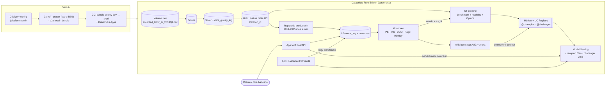

# Credit Risk Platform 2.0 · Lending Club on Databricks

[](https://github.com/wilder14-eslu/credit-risk-platform-2.0/actions/workflows/ci.yml)
[](https://github.com/wilder14-eslu/credit-risk-platform-2.0/actions/workflows/cd.yml)
[](https://github.com/wilder14-eslu/credit-risk-platform-2.0/actions/workflows/codeql.yml)


Plataforma de **riesgo crediticio** (probabilidad de default) construida sobre
**2.26 millones de préstamos reales de Lending Club (2007-2018)** y desplegada 100% en
**Databricks Free Edition**, siguiendo el nivel 2 de madurez MLOps de Google
(CI/CD + Continuous Training + monitoreo en producción).

> Versión anterior (Docker + PostgreSQL + Prefect, dataset Give Me Some Credit):
> [credit-risk-ml-platform](https://github.com/wilder14-eslu/credit-risk-ml-platform).

## Qué la hace distinta

| Tema | Decisión | Por qué importa |
|---|---|---|
| **Validación out-of-time** | Train 2007-2012, validación 2013-H1, test 2013-H2; nunca split aleatorio | Así se valida un scorecard en la banca: el modelo se mide en préstamos posteriores a los que vio |
| **Sin data leakage** | Solo variables conocidas al solicitar; pagos, recuperaciones y último FICO se descartan en Bronze | Lending Club trae ~20 columnas posteriores al desembolso que inflan el AUC artificialmente |
| **Sin sesgo de censura** | Un préstamo solo se etiqueta si su plazo terminó antes del corte del archivo (`label_snapshot`) | Los préstamos recientes con desenlace están sesgados a defaults tempranos; sin esto el modelo aprende que "60 meses = default" |
| **Drift real, no simulado** | La producción es un *replay* mes a mes de la originación real 2014-2015 | El monitoreo detecta cambios reales de Lending Club (mezcla de propósitos, verificación de ingresos, programa *whole loan*) |
| **Etiquetas con retraso** | El desenlace se conoce `label_delay_months` después; data drift actúa como alerta temprana | Refleja la realidad de crédito: la performance llega tarde |
| **A/B testing real** | Champion y challenger en el mismo endpoint de Model Serving; asignación sticky por `loan_id` | La promoción se decide con bootstrap del AUC y test z sobre morosidad de aprobados |

## Arquitectura



| Pieza | Tecnología en Databricks |
|---|---|
| Ingesta y calidad | Jobs serverless, Delta Lake, `mapInPandas` con el mismo parser probado en CI |
| Feature store | Feature table en Unity Catalog con PK `loan_id` |
| Entrenamiento continuo | Benchmark Regresión Logística / XGBoost / LightGBM / CatBoost + Optuna |
| Registro | MLflow en Unity Catalog con aliases `@champion`, `@challenger`, `@previous_champion` |
| Serving | **Model Serving** (API REST de Databricks) con 2 served entities |
| API y panel | **Databricks Apps**: FastAPI (`apps/api`) y Streamlit (`apps/dashboard`), autenticadas con OAuth del workspace |
| Orquestación | Databricks Jobs con `condition_task` y `run_job_task` (monitoreo → CT) |
| CI/CD | GitHub Actions + Databricks Asset Bundles (`databricks.yml`) |

## Niveles de madurez MLOps (Google Cloud)

| Nivel | Requisito | Implementación |
|---|---|---|
| 1 | Pipeline de entrenamiento automatizado | Job `ct_training_pipeline` (Bronze → Silver → Gold → train → validación → deploy) |
| 1 | Validación de datos | `data/quality.py`: expectativas bloqueantes (nulos, rangos, duplicados, **columnas de leakage**) |
| 1 | Validación de modelo | Gate absoluto (AUC, sobreajuste, Brier, latencia) + gate relativo champion vs challenger en el mismo test OOT |
| 1 | Feature store y metadata | Feature table UC + MLflow (corridas anidadas por candidato, periodos, informe) |
| 1 | Continuous Training | Schedule semanal **y** disparado por el monitoreo con ventanas desplazadas (`as_of`) |
| 2 | CI | Lint, tests (3.11/3.12), cobertura ≥ 85%, **pipeline end-to-end en local**, validación del bundle, CodeQL |
| 2 | CD del pipeline y del modelo | `bundle deploy` dev → prod con aprobación; `04_validate_and_deploy.py` actualiza el endpoint |
| 2 | Monitoreo y experimentación online | Data, prediction y concept drift; A/B testing con promoción automática; rollback |

## Monitoreo: tipos de drift

| Tipo | Qué cambia | Detección |
|---|---|---|
| Data drift | P(X) | PSI por variable (numéricas y categóricas) + test KS |
| Prediction drift | P(ŷ) | PSI de la distribución de scores |
| Concept drift | P(y\|X) | Caída de AUC/KS, Brier, **DDM** sobre errores, **Page-Hinkley** sobre log-loss |
| Prior shift | P(y) | Test de dos proporciones sobre la tasa de default |

## Estructura

```text
├── databricks.yml               # Asset Bundle: targets dev/prod, apps en prod
├── resources/jobs.yml           # CT pipeline, monitoreo + A/B + CT, rollback
├── config/
│   ├── data_schema.yaml         # Variables, target, columnas de leakage
│   └── platform.yaml            # Cortes temporales, gates, drift, A/B, serving
├── src/credit_risk/
│   ├── data/                    # Parser Lending Club, calidad, datos sintéticos (CI)
│   ├── features/                # Variables derivadas + preprocesador (viaja con el modelo)
│   ├── models/                  # Candidatos, métricas, split OOT, modelo pyfunc con SHAP
│   ├── monitoring/              # Data/concept drift, A/B, replay temporal, política de CT
│   └── registry/                # MLflow/UC y Model Serving (+ permisos de las apps)
├── jobs/                        # 01 ingesta … 08 rollback
├── apps/api/                    # Databricks App: FastAPI
├── apps/dashboard/              # Databricks App: Streamlit
├── tests/                       # 50 tests + tests/e2e (pipeline completo con DuckDB)
└── docs/                        # DATA.md, DEPLOYMENT.md
```

## Inicio rápido

```powershell
python -m venv .venv
.\.venv\Scripts\Activate.ps1
pip install -r requirements-dev.txt

pytest                                         # 50 tests, sin Databricks
python tests/e2e/run_pipeline_locally.py       # ciclo completo con datos sintéticos
python tests/e2e/run_pipeline_locally.py --csv data/accepted_2007_to_2018Q4.csv --rows 400000
```

Datos: [docs/DATA.md](docs/DATA.md) · Despliegue paso a paso: [docs/DEPLOYMENT.md](docs/DEPLOYMENT.md)

```bash
databricks bundle deploy -t dev
databricks bundle run -t dev ct_training_pipeline
databricks bundle run -t dev production_monitoring --params months=6
```

## Autor

**Wilder Espinoza Luna** · Estadística (UNMSM) · Machine Learning Engineering
