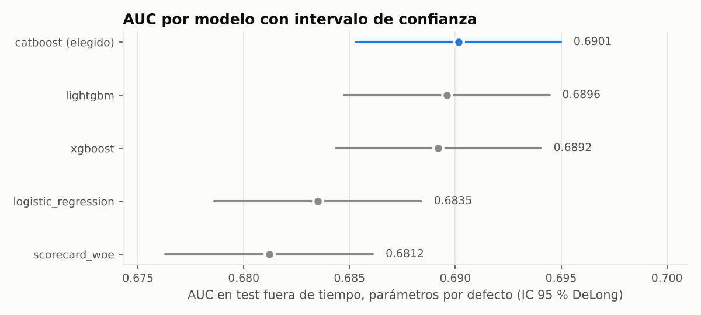
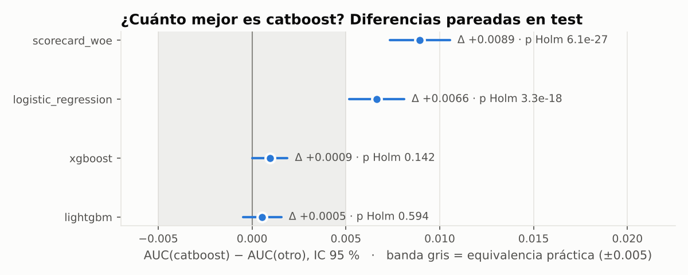
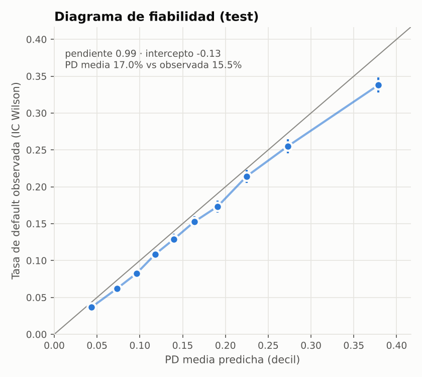
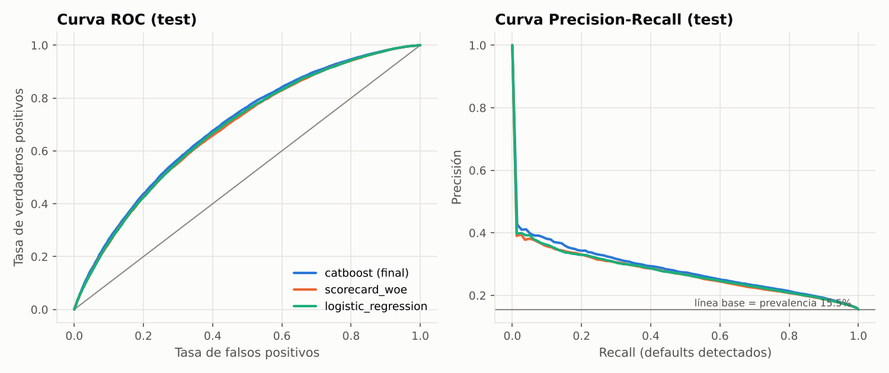
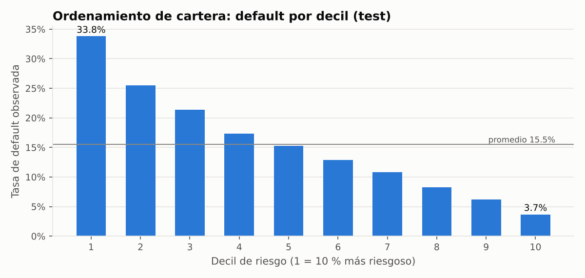
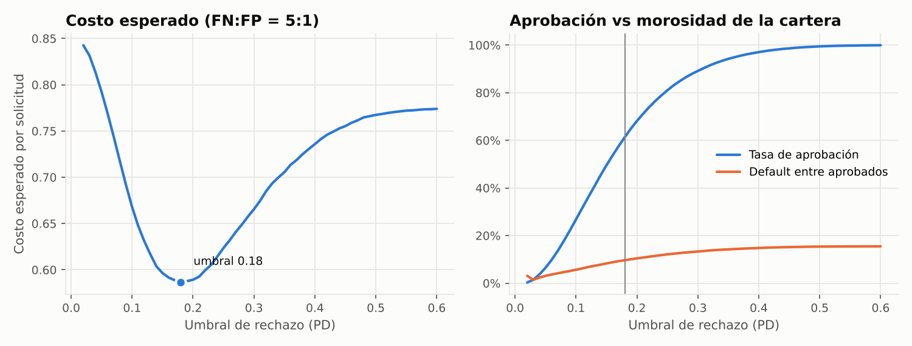
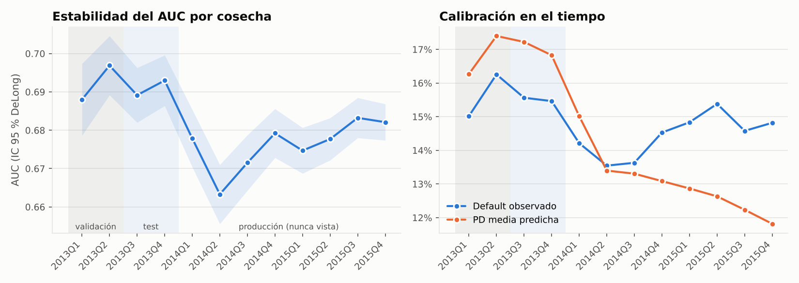
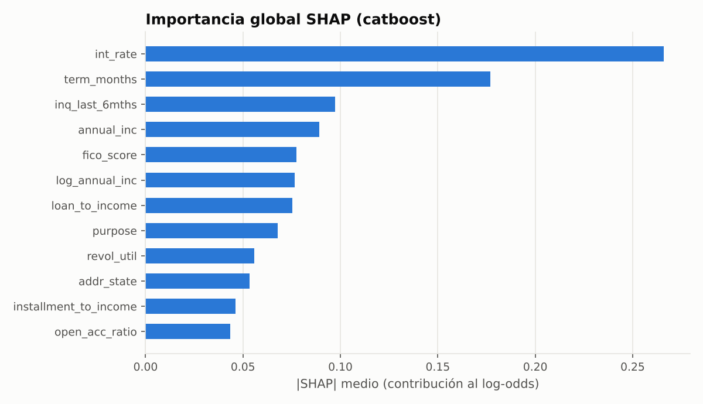
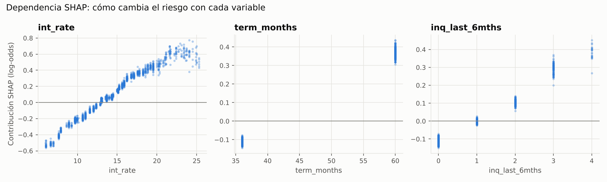
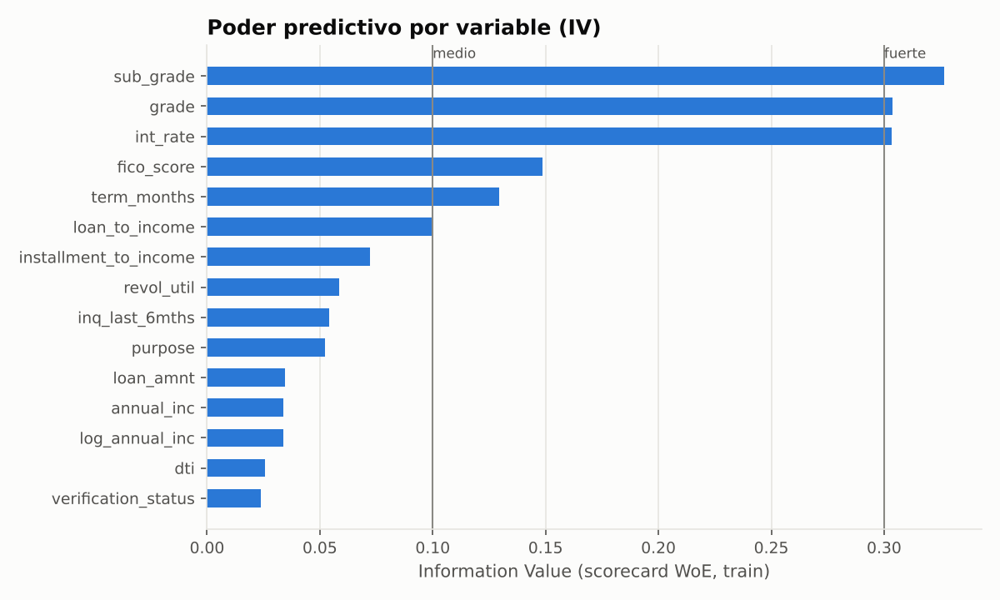

# Credit Risk Platform 2.0 · Lending Club on Databricks

[](https://github.com/wilder14-eslu/credit-risk-platform-2.0/actions/workflows/ci.yml)
[](https://github.com/wilder14-eslu/credit-risk-platform-2.0/actions/workflows/cd.yml)
[](https://github.com/wilder14-eslu/credit-risk-platform-2.0/actions/workflows/codeql.yml)


Plataforma end-to-end de **riesgo crediticio** (probabilidad de default) sobre **2.26 millones de préstamos
reales de Lending Club (2007-2018)**, desplegada 100% en **Databricks Free Edition**: desde el planteamiento
del problema hasta el despliegue, el monitoreo en producción, el A/B testing y el reentrenamiento continuo,
con todo el ciclo automatizado como código.

> **Reporte técnico completo:** [docs/REPORTE_TECNICO.md](docs/REPORTE_TECNICO.md) (metodología, resultados,
> decisiones estadísticas y limitaciones).

## En 30 segundos

| | |
|---|---|
| **Problema** | Decidir si aprobar una solicitud de crédito estimando su probabilidad de default (PD) con información disponible solo al momento de solicitar |
| **Datos** | Lending Club 2007-2018, 151 columnas; se usan 26 variables de la solicitud más 5 derivadas |
| **Modelo en producción** | Elegido con una regla estadística (DeLong + Holm + parsimonia) entre 4 algoritmos y un scorecard WoE; AUC ~0.69 en test fuera de tiempo |
| **Plataforma** | Databricks Free Edition: Jobs serverless, Delta Lake, Unity Catalog, MLflow, Model Serving y Databricks Apps |
| **MLOps** | Nivel 2 de Google: CI/CD con entornos dev, staging y prod; entrenamiento continuo disparado por drift; A/B testing con promoción y rollback |
| **Calidad** | 91 tests (cobertura ~94%), pipeline end-to-end en CI, CodeQL, Dependabot, lineage código-datos-modelo |

## Resultados y análisis estadístico

Toda esta sección (cifras, tablas, gráficas y conclusiones) se genera con
`python scripts/build_report.py --data <CSV de Lending Club>` (o `make report`) sobre los datos reales, con
el mismo flujo del entrenamiento en producción: el modelo se **elige en la validación** con una regla
estadística y el **test fuera de tiempo se usa una sola vez** para confirmar. Las cifras completas quedan en
[`reports/results.json`](reports/results.json) y cada entrenamiento en Databricks registra el mismo reporte en
MLflow.

<!-- RESULTADOS:INICIO (generado por scripts/build_report.py; no editar a mano) -->

_Generado el 2026-10-04 04:34 UTC desde `accepted_2007_to_2018Q4.csv, préstamos emitidos 2007-2015 (887,429 préstamos)`._

### Resumen de la decisión

| | |
|---|---|
| **Modelo elegido** | `catboost` (ajustado con Optuna) |
| **Por qué** | catboost es el de mayor AUC de validación; empata en la práctica con lightgbm, xgboost (se prefiere por AUC a igual complejidad); logistic_regression es peor de forma significativa y material (regla de parsimonia, decidida en validación) |
| **AUC en test fuera de tiempo** | **0.6912** IC 95 % [0.6863, 0.6960] · Gini 0.382 |
| **KS / PR-AUC** | 0.277 [0.270, 0.287] · 0.279 (prevalencia 15.5%) |
| **Decisión** | Umbral 0.18: aprueba 61.3%, morosidad de aprobados 9.6% (vs 15.5% sin modelo), detecta 61.9% de los defaults |
| **Quality gates** | aprobados |

### Por qué este modelo

1. **Empate práctico entre los más complejos.** `catboost` no supera de forma material a `lightgbm`, `xgboost`: todas las diferencias son menores al margen práctico de 0.005 de AUC (la de `xgboost` es estadísticamente detectable con este tamaño de muestra, pero no relevante). La elección entre ellos es indiferente para el negocio y se resuelve por complejidad y luego por AUC.
2. **`logistic_regression` queda descartado en validación**: es peor por 0.0073 de AUC (p Holm < 0.001), una diferencia significativa y mayor al margen práctico.
3. **Frente a `logistic_regression`** el modelo gana +0.0066 de AUC en test, IC 95 % [+0.0052, +0.0081], p Holm < 0.001: diferencia significativa y material.
4. **Frente a `scorecard_woe`** el modelo gana +0.0089 de AUC en test, IC 95 % [+0.0073, +0.0105], p Holm < 0.001: diferencia significativa y material.
5. **El tuning con Optuna aporta poco.** En validación (donde se decide) mejora +0.0003 de AUC (p 0.433); en test +0.0010 (p 0.002): significativa pero prácticamente irrelevante. El techo lo pone la información disponible, no los hiperparámetros.
6. **Aporte propio vs el scoring de Lending Club.** Sin `grade`, `sub_grade` ni `int_rate` el AUC baja de 0.6912 a 0.6815 (pérdida 0.0097, IC [0.0077, 0.0117], p < 0.001): diferencia significativa y material. Aun así, el modelo conserva 94.9% de su poder discriminante (Gini) solo con variables del solicitante.
7. **Calibración: ordena bien, pero sobreestima el nivel.** Pendiente 0.99 (ideal 1): la escala relativa es correcta. Intercepto -0.13 y Spiegelhalter p < 0.001: la PD media (17.0%) difiere de la tasa observada (15.5%). Para usar la PD como probabilidad (pricing, pérdida esperada) conviene recalibrar el intercepto con la validación.
8. **Estabilidad temporal.** El AUC por trimestre se mueve entre 0.663 y 0.697 en 12 cosechas, incluida la producción nunca vista. En 2015Q4 la PD media es 11.8% vs 14.8% observado: la deriva de nivel es la señal que el monitoreo usa para disparar el reentrenamiento.

### 1. Datos y diseño de validación

| Periodo | Préstamos | Rol |
|---|---|---|
| Entrenamiento: 2007-06 a 2012-12 | 95,902 | Ajuste de modelos (default 15.7%) |
| Validación: 2013-01 a 2013-06 | 53,374 | **Decide**: selección, tuning y umbral |
| Test: 2013-07 a 2013-12 | 81,430 | **Solo reporta** (default 15.5%) |

### 2. Benchmark de candidatos

| Modelo | AUC train | AUC validación | AUC test | Brecha train-val | KS test | Brier test | Latencia (ms) |
|---|---|---|---|---|---|---|---|
| catboost | 0.7224 | 0.6932 | 0.6901 | +0.0292 | 0.2744 | 0.1235 | 0.076 |
| lightgbm | 0.7363 | 0.6925 | 0.6896 | +0.0437 | 0.2745 | 0.1236 | 0.078 |
| xgboost | 0.7266 | 0.6917 | 0.6892 | +0.0349 | 0.2732 | 0.1235 | 0.088 |
| logistic_regression | 0.6975 | 0.6860 | 0.6835 | +0.0115 | 0.2682 | 0.1244 | 0.077 |

### 3. Selección estadística en la validación

Regla: cada candidato se compara con el de mayor AUC de validación mediante el **test de DeLong** (mismos préstamos), con **ajuste de Holm**. Se descarta solo si es peor de forma significativa (p Holm < 0.05) **y** material (ΔAUC ≥ 0.005). Entre los que quedan gana el más simple; a igual complejidad, el de mayor AUC.

| Modelo | AUC validación | Δ vs mejor | p Holm | Complejidad | Retenido | Elegido |
|---|---|---|---|---|---|---|
| catboost | 0.6932 | +0.0000 | 1.000 | 2 | sí | **sí** |
| lightgbm | 0.6925 | +0.0007 | 0.243 | 2 | sí |  |
| xgboost | 0.6917 | +0.0016 | 0.011 | 2 | sí |  |
| logistic_regression | 0.6860 | +0.0073 | < 0.001 | 1 | no |  |

### 4. Confirmación en el test fuera de tiempo

Los candidatos se comparan en igualdad de condiciones (parámetros por defecto, mismos préstamos). El modelo final es el elegido, después ajustado con Optuna; su efecto se mide al final de esta sección.





<details><summary>Todas las comparaciones pareadas (DeLong + Holm)</summary>

| A | B | Δ AUC | IC 95 % | p | p Holm | Lectura |
|---|---|---|---|---|---|---|
| catboost | lightgbm | +0.0005 | [-0.0005, +0.0016] | 0.297 | 0.594 | Sin evidencia de diferencia: modelos prácticamente equivalentes |
| catboost | xgboost | +0.0009 | [+0.0000, +0.0019] | 0.047 | 0.142 | Sin evidencia de diferencia: modelos prácticamente equivalentes |
| catboost | logistic_regression | +0.0066 | [+0.0052, +0.0081] | < 0.001 | < 0.001 | Diferencia significativa y material a favor de A |
| catboost | scorecard_woe | +0.0089 | [+0.0073, +0.0105] | < 0.001 | < 0.001 | Diferencia significativa y material a favor de A |
| lightgbm | xgboost | +0.0004 | [-0.0004, +0.0012] | 0.302 | 0.594 | Sin evidencia de diferencia: modelos prácticamente equivalentes |
| lightgbm | logistic_regression | +0.0061 | [+0.0045, +0.0077] | < 0.001 | < 0.001 | Diferencia significativa y material a favor de A |
| lightgbm | scorecard_woe | +0.0084 | [+0.0066, +0.0102] | < 0.001 | < 0.001 | Diferencia significativa y material a favor de A |
| xgboost | logistic_regression | +0.0057 | [+0.0041, +0.0073] | < 0.001 | < 0.001 | Diferencia significativa y material a favor de A |
| xgboost | scorecard_woe | +0.0080 | [+0.0063, +0.0097] | < 0.001 | < 0.001 | Diferencia significativa y material a favor de A |
| logistic_regression | scorecard_woe | +0.0023 | [+0.0010, +0.0036] | < 0.001 | 0.002 | Estadísticamente significativa pero prácticamente irrelevante |

</details>

**Efecto del tuning con Optuna** (mismo algoritmo, DeLong):

| Periodo | AUC ajustado | AUC por defecto | Δ | p |
|---|---|---|---|---|
| validación | 0.6936 | 0.6932 | +0.0003 | 0.433 |
| test | 0.6912 | 0.6901 | +0.0010 | 0.002 |

### 5. Calibración



| Brier | Brier de referencia (sin modelo) | ECE | Pendiente | Intercepto | Spiegelhalter z | p |
|---|---|---|---|---|---|---|
| 0.1233 | 0.1310 | 0.0150 | 0.989 | -0.133 | -10.45 | < 0.001 |

### 6. Discriminación y ordenamiento de cartera





<details><summary>Tabla de deciles (ganancias y lift)</summary>

| Decil | Préstamos | Default observado | IC 95 % (Wilson) | PD media | Captura acumulada | Lift |
|---|---|---|---|---|---|---|
| 1 | 8,143 | 33.8% | [32.8%, 34.8%] | 37.9% | 21.8% | 2.18 |
| 2 | 8,143 | 25.5% | [24.5%, 26.4%] | 27.3% | 38.2% | 1.64 |
| 3 | 8,143 | 21.4% | [20.5%, 22.3%] | 22.5% | 52.0% | 1.38 |
| 4 | 8,143 | 17.3% | [16.5%, 18.2%] | 19.1% | 63.2% | 1.12 |
| 5 | 8,143 | 15.3% | [14.5%, 16.0%] | 16.4% | 73.0% | 0.98 |
| 6 | 8,143 | 12.9% | [12.2%, 13.6%] | 14.0% | 81.3% | 0.83 |
| 7 | 8,143 | 10.8% | [10.2%, 11.5%] | 11.8% | 88.3% | 0.70 |
| 8 | 8,143 | 8.3% | [7.7%, 8.9%] | 9.6% | 93.6% | 0.53 |
| 9 | 8,143 | 6.2% | [5.7%, 6.7%] | 7.3% | 97.6% | 0.40 |
| 10 | 8,143 | 3.7% | [3.3%, 4.1%] | 4.4% | 100.0% | 0.24 |

</details>

### 7. Umbral de decisión por costos

El umbral minimiza el costo esperado en la **validación** con FN:FP = 5:1 (otorgar a quien incumple cuesta más que rechazar a un buen pagador) y se mide aquí en test.



| Umbral | Aprobación | Default entre aprobados | Recall | Precisión | Costo esperado |
|---|---|---|---|---|---|
| 0.10 | 26.8% | 5.6% | 90.3% | 19.1% | 0.668 |
| 0.15 | 49.5% | 8.3% | 73.5% | 22.6% | 0.596 |
| 0.18 **(elegido)** | 61.3% | 9.6% | 61.9% | 24.8% | 0.586 |
| 0.20 | 68.1% | 10.4% | 54.3% | 26.4% | 0.589 |
| 0.25 | 81.0% | 12.1% | 36.7% | 30.0% | 0.624 |
| 0.30 | 89.2% | 13.3% | 23.5% | 33.6% | 0.665 |

### 8. Estabilidad por cosecha (incluye producción nunca vista)



<details><summary>Tabla por trimestre</summary>

| Trimestre | Préstamos | AUC | IC 95 % | Default observado | PD media |
|---|---|---|---|---|---|
| 2013Q1 | 22,706 | 0.6880 | [0.6786, 0.6974] | 15.0% | 16.3% |
| 2013Q2 | 30,668 | 0.6969 | [0.6892, 0.7046] | 16.3% | 17.4% |
| 2013Q3 | 37,571 | 0.6891 | [0.6820, 0.6963] | 15.6% | 17.2% |
| 2013Q4 | 43,859 | 0.6930 | [0.6864, 0.6996] | 15.5% | 16.8% |
| 2014Q1 | 38,193 | 0.6779 | [0.6704, 0.6853] | 14.2% | 15.0% |
| 2014Q2 | 37,880 | 0.6633 | [0.6556, 0.6710] | 13.5% | 13.4% |
| 2014Q3 | 40,595 | 0.6715 | [0.6643, 0.6788] | 13.6% | 13.3% |
| 2014Q4 | 50,020 | 0.6792 | [0.6728, 0.6856] | 14.5% | 13.1% |
| 2015Q1 | 56,568 | 0.6747 | [0.6687, 0.6807] | 14.8% | 12.9% |
| 2015Q2 | 64,222 | 0.6777 | [0.6722, 0.6832] | 15.4% | 12.6% |
| 2015Q3 | 73,567 | 0.6832 | [0.6780, 0.6885] | 14.6% | 12.2% |
| 2015Q4 | 88,664 | 0.6821 | [0.6774, 0.6868] | 14.8% | 11.8% |

</details>

### 9. Explicabilidad (SHAP)





| Variable | Media de abs(SHAP) | Dirección (Spearman valor-SHAP) |
|---|---|---|
| int_rate | 0.2660 | +0.99 (más valor, más riesgo) |
| term_months | 0.1769 | +0.77 (más valor, más riesgo) |
| inq_last_6mths | 0.0973 | +0.92 (más valor, más riesgo) |
| annual_inc | 0.0892 | -0.99 (más valor, menos riesgo) |
| fico_score | 0.0775 | -0.97 (más valor, menos riesgo) |
| log_annual_inc | 0.0765 | -0.99 (más valor, menos riesgo) |
| loan_to_income | 0.0753 | +0.99 (más valor, más riesgo) |
| purpose | 0.0680 | categórica |
| revol_util | 0.0557 | +0.99 (más valor, más riesgo) |
| addr_state | 0.0534 | categórica |
| installment_to_income | 0.0463 | +0.97 (más valor, más riesgo) |
| open_acc_ratio | 0.0433 | +0.96 (más valor, más riesgo) |

SHAP describe asociaciones que el modelo aprendió, no efectos causales.

### 10. Ablación: ¿cuánto depende del scoring de Lending Club?

| Variables | AUC test | Δ vs completo | IC 95 % | p (DeLong) |
|---|---|---|---|---|
| Todas | 0.6912 | | | |
| Sin grade, sub_grade, int_rate | 0.6815 | -0.0097 | [-0.0117, -0.0077] | < 0.001 |

### 11. Scorecard WoE e Information Value



El scorecard (benchmark regulatorio) obtiene AUC 0.6812 IC [0.6763, 0.6861] en test.

| Variable | IV | Poder predictivo |
|---|---|---|
| sub_grade | 0.327 | fuerte |
| grade | 0.304 | fuerte |
| int_rate | 0.303 | fuerte |
| fico_score | 0.149 | medio |
| term_months | 0.129 | medio |
| loan_to_income | 0.100 | débil |
| installment_to_income | 0.072 | débil |
| revol_util | 0.058 | débil |
| inq_last_6mths | 0.054 | débil |
| purpose | 0.052 | débil |

<!-- RESULTADOS:FIN -->

## Arquitectura


```mermaid
flowchart LR
    subgraph GH["GitHub"]
        code["Código + config<br/>(platform.yaml)"] --> ci["CI: ruff, pytest (cov 85%+),<br/>e2e local, validar bundle, CodeQL"]
        ci --> dev["CD: deploy dev"]
        dev --> stg["Gate staging:<br/>CT + monitoreo + smoke check<br/>de trazabilidad"]
        stg --> prod["Deploy prod<br/>(con aprobación)"]
    end

    subgraph DBX["Databricks Free Edition (serverless)"]
        direction TB
        vol[("Volume raw<br/>CSV Lending Club")] --> bronze[("Bronze")]
        bronze --> silver[("Silver + data_quality_log")]
        silver --> gold[("Gold: feature table UC<br/>PK loan_id, versionada en Delta")]
        gold --> train["CT pipeline<br/>benchmark 4 modelos + Optuna"]
        train --> reg[["MLflow + UC Registry<br/>@champion, @challenger<br/>tags git_sha + versión Delta"]]
        reg --> serve["Model Serving<br/>champion 80%, challenger 20%"]
        gold --> replay["Replay de producción<br/>2014-2015 mes a mes"]
        replay --> log[("inference_log + outcomes")]
        log --> mon["Monitoreo<br/>PSI, KS, DDM, Page-Hinkley"]
        mon --> ab["A/B: bootstrap AUC + z-test"]
        ab -->|promover / detener| reg
        mon -->|drift: retrain con as_of| train
        api["App: API FastAPI"] -->|variante sticky por loan_id| serve
        api --> log
        dash["App: Dashboard Streamlit"] --> serve
        dash -->|SQL warehouse| log
    end

    prod --> DBX
    client(["Cliente / core bancario"]) --> api
```

| Pieza | Tecnología |
|---|---|
| Ingesta y calidad | Jobs serverless, Delta Lake, expectativas bloqueantes (nulos, rangos, duplicados, columnas de leakage) |
| Feature store | Feature table en Unity Catalog con PK `loan_id`; el preprocesador viaja dentro del modelo para evitar *training-serving skew* |
| Entrenamiento | Regresión logística, XGBoost, LightGBM, CatBoost + Optuna con penalización de sobreajuste |
| Registro | MLflow en Unity Catalog con aliases `@champion`, `@challenger`, `@previous_champion` |
| Serving | Model Serving con dos variantes y split de tráfico para A/B |
| API y panel | Databricks Apps: FastAPI (`apps/api`) y Streamlit (`apps/dashboard`) |
| Orquestación | Databricks Jobs con `condition_task` y `run_job_task` (monitoreo dispara reentrenamiento) |
| Infraestructura como código | Databricks Asset Bundles (`databricks.yml`, `resources/jobs.yml`) |
| CI/CD | GitHub Actions: dev, gate de integración en staging, prod con aprobación |

## Ciclo de vida cubierto

| Fase | Qué se hace | Dónde |
|---|---|---|
| 1. Planteamiento | Decisión de negocio, definición del target, costo asimétrico (otorgar a un moroso cuesta 5 veces más que rechazar a un buen pagador) | [Reporte, sección 2](docs/REPORTE_TECNICO.md#2-planteamiento-del-problema) |
| 2. Datos | Parser del CSV crudo, eliminación de 22 columnas de leakage, control del sesgo de censura | `src/credit_risk/data/`, [DATA.md](docs/DATA.md) |
| 3. Calidad | Expectativas bloqueantes registradas en `data_quality_log` | `src/credit_risk/data/quality.py` |
| 4. Variables | 26 variables de la solicitud + 5 ratios derivados + indicadores de faltantes | `src/credit_risk/features/` |
| 5. Validación | Split temporal: train 2007-2012, validación 2013-H1, test 2013-H2 | `src/credit_risk/models/training.py` |
| 6. Modelado | Benchmark, Optuna, umbral por costo esperado, quality gates absolutos y relativos | `jobs/03_train_register.py`, `jobs/04_validate_and_deploy.py` |
| 7. Explicabilidad | Contribuciones SHAP por solicitud (top 3 razones) y bandas de riesgo A-E | `src/credit_risk/models/credit_model.py` |
| 8. Despliegue | Registro en UC, Model Serving con A/B, API y dashboard | `src/credit_risk/registry/`, `apps/` |
| 9. Monitoreo | Data, prediction y concept drift; prior shift; etiquetas con retraso | `src/credit_risk/monitoring/`, `jobs/06_monitor.py` |
| 10. Experimentación | A/B champion vs challenger con promoción automática y rollback | `jobs/07_ab_evaluate.py`, `jobs/08_rollback.py` |
| 11. Reentrenamiento | Continuous Training semanal y disparado por drift, con ventanas desplazadas | `resources/jobs.yml` |
| 12. Operación | Reintentos idempotentes, timeouts, alertas, lineage, entornos aislados | [DEPLOYMENT.md](docs/DEPLOYMENT.md#7-entornos-confiabilidad-y-límites-de-free-edition) |

## Decisiones que hacen la diferencia

| Tema | Decisión | Por qué importa |
|---|---|---|
| **Validación fuera de tiempo** | Split por fecha de emisión, nunca aleatorio | Así se valida un scorecard en banca: el modelo se mide en préstamos posteriores a los que vio |
| **Sin data leakage** | Solo variables conocidas al solicitar; 22 columnas posteriores al desembolso se descartan y un test lo verifica | Es el error más común con este dataset e infla el AUC artificialmente |
| **Sin sesgo de censura** | Solo se etiquetan préstamos cuyo plazo terminó antes del corte del archivo | Entre los préstamos recientes, los que ya tienen desenlace son sobre todo defaults tempranos |
| **Umbral por costo** | El umbral minimiza el costo esperado en validación (FN = 5, FP = 1), no se fija en 0.5 | Alinea la decisión con el negocio en vez de con la exactitud |
| **Drift real, no simulado** | La producción es un replay mes a mes de la originación real 2014-2015 | El monitoreo detecta cambios reales del portafolio de Lending Club |
| **Etiquetas con retraso** | El desenlace llega después; el data drift actúa como alerta temprana | En crédito la performance real llega tarde |
| **A/B testing real** | Dos variantes en el mismo endpoint, asignación determinista por hash de `loan_id` | La promoción se decide con bootstrap del AUC y test z sobre la morosidad de aprobados |
| **Trazabilidad** | Cada versión del modelo guarda su commit (`git_sha`) y la versión Delta exacta de sus datos | Cualquier modelo en producción se puede reproducir con *time travel* |
| **Staging como gate** | Un pipeline completo en staging debe pasar antes de tocar prod | Un error de integración nunca llega a producción |
| **Selección estadística** | Validación decide, test se mide una vez; DeLong + Holm + margen práctico + parsimonia | Evita la "maldición del ganador" y no premia diferencias de ruido con más complejidad |
| **Scorecard WoE** | Benchmark tradicional con binning, WoE, IV y puntos (PDO 20, 600 = odds 50:1) | Es la referencia que entiende y exige un regulador |

## Monitoreo: tipos de drift

| Tipo | Qué cambia | Detección |
|---|---|---|
| Data drift | P(X) | PSI por variable (numéricas y categóricas) + test KS |
| Prediction drift | P(ŷ) | PSI de la distribución de scores |
| Concept drift | P(y\|X) | Caída de AUC/KS, Brier, **DDM** sobre errores, **Page-Hinkley** sobre log-loss |
| Prior shift | P(y) | Test de dos proporciones sobre la tasa de default |

Umbrales versionados en [`config/platform.yaml`](config/platform.yaml): cambiarlos pasa por CI/CD.

## Madurez MLOps (Google Cloud)

| Nivel | Requisito | Implementación |
|---|---|---|
| 1 | Pipeline de entrenamiento automatizado | Job `ct_training_pipeline`: Bronze, Silver, Gold, entrenamiento, validación, despliegue |
| 1 | Validación de datos y de modelo | Expectativas bloqueantes; gates absolutos (AUC, sobreajuste, Brier, latencia) y relativos (champion vs challenger en el mismo test) |
| 1 | Feature store y metadata | Feature table en UC + MLflow con corridas anidadas por candidato |
| 1 | Continuous Training | Schedule semanal y disparo desde el monitoreo con ventanas desplazadas (`as_of`) |
| 2 | CI | Lint, tests (3.11 y 3.12), cobertura 85%+, pipeline end-to-end local, validación del bundle, CodeQL |
| 2 | CD del pipeline y del modelo | dev, gate de integración en staging con smoke check de trazabilidad, prod con aprobación |
| 2 | Monitoreo y experimentación online | Data, prediction y concept drift; A/B con promoción automática; rollback |

## Ingeniería y confiabilidad

- **Tests:** 91 tests unitarios y de contrato (cobertura ~94%) más un pipeline end-to-end que ejecuta todos los
  jobs en local con DuckDB y MLflow sobre SQLite, sin necesidad de Databricks.
- **Contratos de infraestructura:** los tests verifican que todas las tareas sean serverless, que solo las
  tareas idempotentes tengan reintentos, que staging y prod no compartan esquema ni endpoint y que no haya
  correos ni carpetas compartidas en la configuración.
- **Jobs:** timeout por tarea y por job, cola, alertas por fallo y por duración; reintentos solo donde
  repetir no duplica datos.
- **Seguridad:** secretos solo en GitHub Actions, CodeQL, Dependabot y despliegue bajo la carpeta del usuario.

## Limitaciones conocidas y roadmap

**Ya resuelto:** la selección del modelo sobre el test, la falta de inferencia sobre las diferencias de AUC y la
ausencia de un scorecard de referencia (ver [resultados y análisis estadístico](#resultados-y-análisis-estadístico)).

Lo que un revisor exigente todavía señalaría, y cómo se va a abordar:

| Limitación | Impacto | Próximo paso |
|---|---|---|
| El target usa desenlaces que no se conocían al momento de entrenar (préstamos de 2012 terminan en 2015-2017) | El backtest respeta el orden de emisión, pero no la disponibilidad de la etiqueta | Target de PD a 12 meses (estándar Basilea) o modelo de supervivencia con censura |
| El replay asume que el desenlace se conoce a los 6 meses | Simplificación de la llegada real de etiquetas | Alinear el retraso con la definición del target |
| La PD sobreestima el nivel en el test (17.0 % vs 15.5 %) y lo subestima en 2015 | Ordena bien, pero la PD no se puede usar tal cual como probabilidad | Recalibrar el intercepto con la validación y monitorear la calibración por cosecha |
| Las Databricks Apps requieren login del workspace y en Free Edition se apagan a las 24 horas | No hay demo pública | Demo en Hugging Face Spaces con el modelo `@champion` exportado |

## Estructura

```text
├── databricks.yml               # Asset Bundle: targets dev, staging y prod; Apps solo en prod
├── resources/jobs.yml           # CT pipeline, monitoreo + A/B + CT, rollback (con políticas de confiabilidad)
├── config/
│   ├── data_schema.yaml         # Variables, target, columnas de leakage
│   └── platform.yaml            # Cortes temporales, gates, drift, A/B, serving
├── src/credit_risk/
│   ├── data/                    # Parser de Lending Club, calidad, datos sintéticos (CI)
│   ├── features/                # Variables derivadas + preprocesador (viaja con el modelo)
│   ├── inference/               # DeLong, Holm, significancia práctica, regla de parsimonia
│   ├── models/                  # Candidatos, scorecard WoE, métricas, split temporal, pyfunc con SHAP
│   ├── monitoring/              # Data y concept drift, A/B, replay, política de CT
│   └── registry/                # MLflow/UC, Model Serving, trazabilidad (lineage)
├── jobs/                        # 01 ingesta ... 08 rollback
├── apps/api/                    # Databricks App: FastAPI
├── apps/dashboard/              # Databricks App: Streamlit
├── tests/                       # Tests unitarios y de contrato + tests/e2e (pipeline completo y smoke check)
└── docs/                        # Reporte técnico, datos y despliegue
```

## Inicio rápido

```powershell
python -m venv .venv
.\.venv\Scripts\Activate.ps1
pip install -r requirements-dev.txt

pytest                                         # 91 tests, sin Databricks
python tests/e2e/run_pipeline_locally.py       # ciclo completo con datos sintéticos
```

En Databricks (guía completa en [DEPLOYMENT.md](docs/DEPLOYMENT.md)):

```bash
databricks bundle deploy -t dev
databricks bundle run -t dev ct_training_pipeline --params source=synthetic
databricks bundle run -t dev production_monitoring --params months=6
```

## Documentación

- [Reporte técnico](docs/REPORTE_TECNICO.md): planteamiento, datos, metodología, resultados, limitaciones.
- [Datos](docs/DATA.md): perfil del archivo, sesgo de censura y cómo subirlo.
- [Despliegue](docs/DEPLOYMENT.md): entornos, CI/CD, confiabilidad y límites de Free Edition.

> Versión anterior (Docker + PostgreSQL + Prefect, dataset Give Me Some Credit):
> [credit-risk-ml-platform](https://github.com/wilder14-eslu/credit-risk-ml-platform).

## Autor

**Wilder Espinoza Luna** · Estadística (UNMSM) · Machine Learning Engineering
